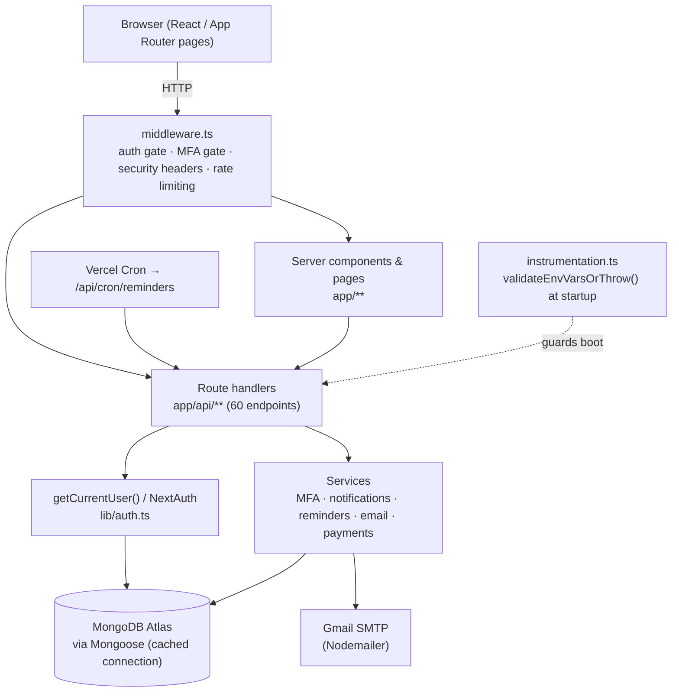
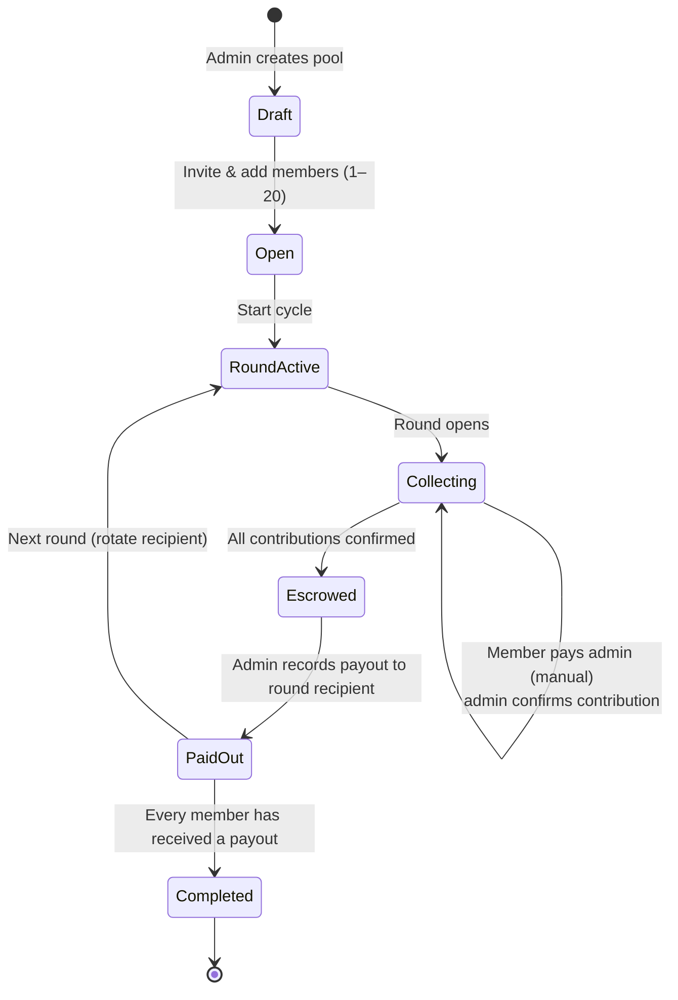
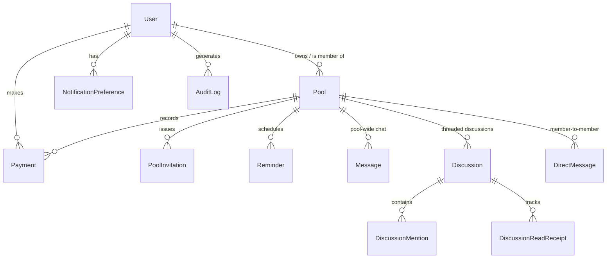

# Architecture

How Juntas Seguras is put together: the request path, the authentication/MFA flow, the pool contribution/payout (escrow) lifecycle, and the data model.

## Stack at a glance

| Concern | Choice |
|---------|--------|
| Framework | Next.js 15 (App Router), React 18, TypeScript |
| API | Route Handlers in `app/api/**` (60 endpoints) |
| Data | MongoDB + Mongoose (12 models) |
| Auth | NextAuth.js v4 (JWT), mandatory MFA (email or TOTP), Google/Microsoft OAuth |
| Cross-cutting | `middleware.ts` (auth gate, MFA gate, security headers, rate limiting), `instrumentation.ts` (env validation at boot) |
| Payments | Manual method tracking (Venmo/PayPal/Zelle/Cash App) + escrow tracking, deep links & Zelle QR; Stripe Identity KYC *scaffolded* |
| Email | Nodemailer + Gmail SMTP |
| Hosting | Vercel + MongoDB Atlas |

## Request flow

Every request passes through `middleware.ts` before hitting a page or route handler. Protected routes require a valid session **and** a completed MFA challenge; API handlers resolve the user via `getCurrentUser()` and talk to MongoDB through a cached Mongoose connection.

## Authentication & MFA

MFA is mandatory. Credentials sign-in verifies the password, then issues a short-lived, unverified session and challenges for an MFA code (email by default, or TOTP). Only after MFA succeeds does `middleware.ts` treat the session as fully authenticated. OAuth (Google / Microsoft) users are resolved by email, which is why `getCurrentUser()` includes an email fallback for non-ObjectId provider IDs.

```mermaid
sequenceDiagram
    participant U as User
    participant App as Next.js (NextAuth)
    participant DB as MongoDB (User)
    participant Mail as Gmail SMTP

    U->>App: Register (email, password)
    App->>DB: Create user (hashed pw), unverified
    App->>Mail: Send email verification code
    U->>App: Verify email code
    App->>DB: Mark email verified

    U->>App: Sign in (credentials or OAuth)
    App->>DB: Validate credentials / resolve OAuth user
    App-->>U: Session issued, MFA required
    App->>Mail: Send MFA code (email MFA) 
    Note over U,App: or user enters TOTP from authenticator app
    U->>App: Submit MFA / TOTP code
    App->>DB: Verify code (lib/services/mfa.ts)
    App-->>U: MFA satisfied → full session (JWT)
    Note over App: middleware.ts enforces auth + MFA on protected routes
```

## Pool contribution & payout (escrow) lifecycle

A pool is a rotating savings circle. Each round, every member contributes a fixed amount; one member receives the full pot. Juntas Seguras does **not** move money — members pay the admin through their chosen app (Venmo/Zelle/PayPal/Cash App), and the app **tracks and confirms** each contribution, holding the round in "escrow" until all contributions are in, then recording the payout to that round's recipient.

## Data model

Twelve Mongoose models (`lib/db/models/`). `Pool` is the aggregate root: it embeds members and transactions and is referenced by payments, invitations, discussions, and reminders. Messaging exists in two forms — pool-wide `Message` (chat) and threaded `Discussion` (with `@mentions` and read receipts).

| Model | Role |
|-------|------|
| `User` | Accounts, auth, MFA, identity-verification state |
| `Pool` | Pool config, embedded members & transactions (aggregate root) |
| `Payment` | Payment records |
| `PoolInvitation` | Member invitations |
| `Message` | Pool-wide chat (older channel, still active) |
| `DirectMessage` | Member-to-member DMs |
| `Discussion` | Threaded discussions |
| `DiscussionMention` | `@mentions` within discussions |
| `DiscussionReadReceipt` | Per-user read state for discussions |
| `AuditLog` | Comprehensive audit trail |
| `Reminder` | Scheduled payment reminders |
| `NotificationPreference` | Per-user notification settings |

## Cross-cutting concerns

- **`middleware.ts`** — gates protected routes on auth + MFA, applies security headers (CSP, HSTS), and rate-limits sensitive endpoints.
- **`instrumentation.ts`** — runs `validateEnvVarsOrThrow()` at server boot so the app fails fast on misconfiguration (`lib/validation.ts`).
- **Connection caching** — `lib/db/connect.ts` memoizes the Mongoose connection on `global` to survive serverless cold starts (smaller pool on Vercel/Lambda).
- **Auditing** — important actions write to `AuditLog` for traceability.
- **Reminders** — `lib/reminders/` + `/api/cron/reminders` (invoked by Vercel Cron, protected by `CRON_SECRET`) send payment reminders; email + in-app today, SMS/web-push are stubbed.

## Notable trade-offs

- **Manual payments over a processor integration.** Real ROSCAs run on trust and existing peer-to-peer apps; tracking-and-confirming avoids holding funds, PCI scope, and money-transmitter concerns. The cost is that settlement is out-of-band, so the admin confirms receipt.
- **JWT sessions.** Stateless sessions fit Vercel's serverless model; the trade-off is revocation is coarser than server-side sessions, mitigated by short lifetimes and the MFA gate.
- **Stripe Identity scaffolded, not wired.** The UI/route/hook exist but `/api/identity/verification` returns `501`; KYC is a roadmap item rather than a claimed feature.
